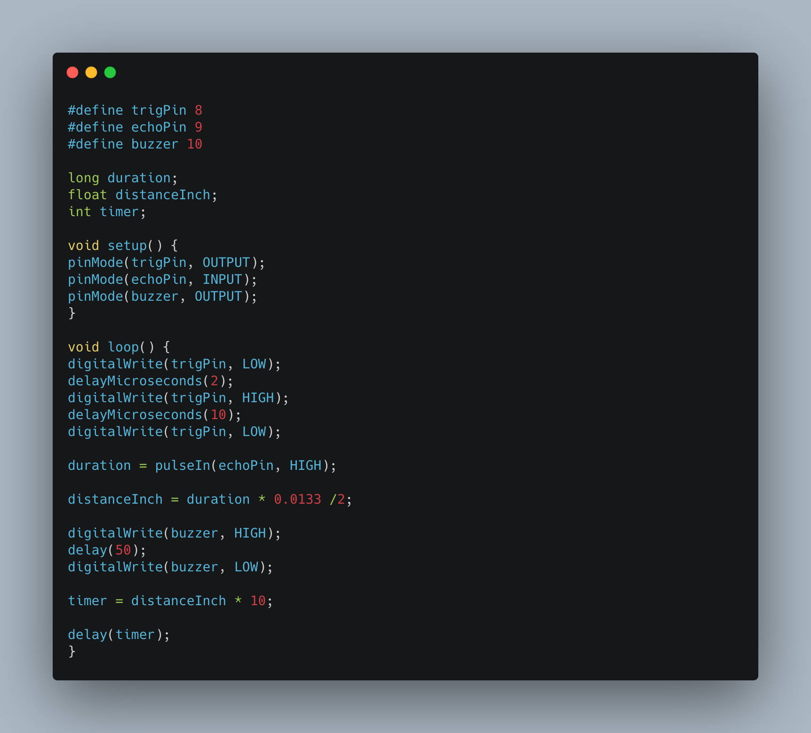

# Third Eye For The Blind
In this project i used ultrasonic sensors and waves to help the blind detect the objects in their surroundings. It warns the user with buzzers and a vibration.

| **Engineer** | **School** | **Area of Interest** | **Grade** |
|:--:|:--:|:--:|:--:|
| Rinna I. | Saratoga Highschool | Hardware Engineering | Incoming Sophomore 

![Headstone Image]: put a link
  
# Final Milestone
My final milestone is the increased reliability and accuracy of my robot. I ameliorated the sagging and fixed the reliability of the finger. As discussed in my second milestone, the arm sags because of weight. I put in a block of wood at the base to hold up the upper arm; this has reverberating positive effects throughout the arm. I also realized that the forearm was getting disconnected from the elbow servo’s horn because of the weight stress on the joint. Now, I make sure to constantly tighten the screws at that joint. 

[

# Second Milestone
For my second milestone I am starting to make a talking smart glass for the blind. This project contains more than one ultrasonic sensor, vibration motor, MP# player module and more. The circuit booard which is used in the project can be designed into a spectacle shape for easy use for the blind. The eudrino will be on the spectacle and this is what will detect the objects. It sill warn the person either through vibrations or beeping. 

[

# First Milestone
  

For first milestone I built the Third Eye or the Blind. It contains a ultrasonic sensor, buzzer, ardiuno uno board and a breadboard. THe ultrasonice sensor detects objects in its surrounding and uses the buzzer to warn the user. The buzzer vibrates and that tells the user there is a a object near by. My challenge was to get the wires connected on the correct parts of the adruino board. Even if the slightest wire was off then the whole thing wouldn't work. Once I solved that problem it was easier to finish the project. For my next mileston i will see it the sensor can detect more than just objects maybe even color or text. 

[![First Milestone]https://youtu.be/ReWsBnCgHpk

